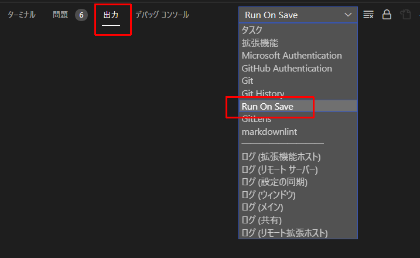

# 個人的なtextlint環境

## Requirements

* WSL2またはLinux環境
* dockerコマンドの利用
* vscodeと連携する場合は [Run on Save - Visual Studio Marketplace](https://marketplace.visualstudio.com/items?itemName=emeraldwalk.RunOnSave) を使うことを想定

## 利用方法

### 手動実行

文章チェックしたい場合は、以下のコマンドを実行

`make check file=(Markdownファイルまでの相対パス)`

textlintによる修復を実行したい場合は、以下のコマンドを実行

`make fix file=(Markdownファイルまでの相対パス)`

### vscodeとの連携

[Run on Save - Visual Studio Marketplace](https://marketplace.visualstudio.com/items?itemName=emeraldwalk.RunOnSave) をインストールした場合、Markdownファイル（`*.md`）を保存した場合に自動実行する。

確認は、「出力」→「Run On Save」を選択すると確認できる。

